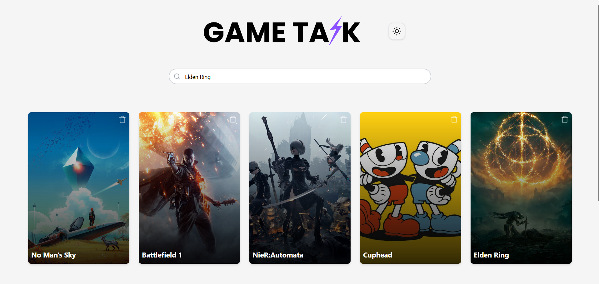

# Game Tazk

  
Projeto em ReactJS e TypeScript, com a finalidade de criar listas de tarefas personalizadas para jogos.

## Recursos Principais

- Busca de jogos usando a API da RAWG.
- Possibilidade de criar cards individuais para cada jogo, contendo listas de tarefas personalizadas.
- Adição de tarefas diretamente em um modal, com suporte a múltiplas entradas automáticas ao pressionar Enter.
- Design responsivo utilizando TailwindCSS.

## Como Usar

- Você pode acessar o projeto [aqui](https://feapolina.github.io/game-tazk). EM PROGRESSO

## Executar Localmente

Clone o projeto:

```bash
git clone https://github.com/feapolina/game-tazk.git
```

Vá para o diretório do projeto:

```bash
cd game-tazk
```

Instale as dependências:

```bash
npm install
```

Inicie o servidor de desenvolvimento:

```bash
npm run dev
```

## Tecnologias Utilizadas

### Back end:

- **Node.js** com TypeScript, gerenciando lógica e persistência.

### Front end:

- **ReactJS** com Vite para performance e simplicidade no desenvolvimento.
- **TailwindCSS** para estilização.
- **shadcn-ui** para modais e checkboxes.
- **Sonner** e **Toast** para notificações.
- **Lucide-React** para ícones.

## Autores

- [@feapolina](https://github.com/feapolina)

## Feedback

Se você tiver algum feedback, entre em contato.
--
